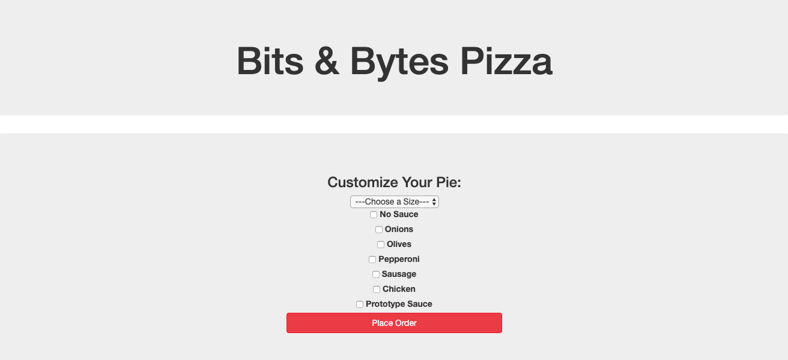

# _Bits & Bytes Pizza_

#### _A website for a pizza company, Jan 2020_

#### By _**Benjamin Thom**_

## Preview


## Description

_A website where users can order pizza and customize their order by selecting a pizza size (small, medium, large), choosing one or more pizza toppings (no sauce, onions, olives, pepperoni, sausage, chicken, prototype sauce), and see the cost of their order._

## Project Specifications

| Behavior | Input | Output |
|---|:---:|:---:|
|1. A button labeled "Order Now" is displayed for the user to click on to start a pizza order| User clicks "Order Now" button|Pizza order options apear|
|2. User is presented with a dropdown menu to selct their pizza size|User clicks on a pizza size option|User input is submitted and user can then see the option they picked|
|3. User can then select pizza toppings from a list of checkbox options|User clicks on all checkbox topping options that they would like to include on their pizza|User can see all topping options they have clicked on|
|4. User clicks "Place Order" button to finalize order and is provided with a summary and the total cost of their order|User clicks "Place Order" button|User input is submitted and the user's order is displayed (pizza size and toppings) along with the total cost of the order|


## Setup/Installation Requirements

_In Terminal:_

* Navigate to where you want this application to be saved, i.e.:
```cd desktop```
* Clone the file from GitHub with HTTPS
```git clone https://github.com/benjamin-thompdx/Pizza-Parlor.git```
* Open file in your preferred text editor
* On Mac: ```open -a {your text editor} Pizza-Parlor```
* On Windows: ```Pizza-Parlor```

_To Download Manually:_

* Navigate to https://github.com/benjamin-thompdx/Pizza-Parlor.
* Click green "Clone or Download" button.
* Click "Download ZIP".
* Click downloaded file to unzip.
* Open folder called "Pizza-Parlor".
* Right click "index.html" and select your preferred browser or text editor.

## Known Bugs

_No known bugs at this time._

## Support and contact details

_Have a bug or an issue with this application? [Open a new issue](https://github.com/benjamin-thompdx/Pizza-Parlor/issues) here on GitHub._

## Technologies Used

* Javascript
* jQuery
* HTML & CSS
* Bootstrap 3.3.7

### License

[MIT](https://choosealicense.com/licenses/mit/)

Copyright (c) 2020 **_Benjamin Thom_**